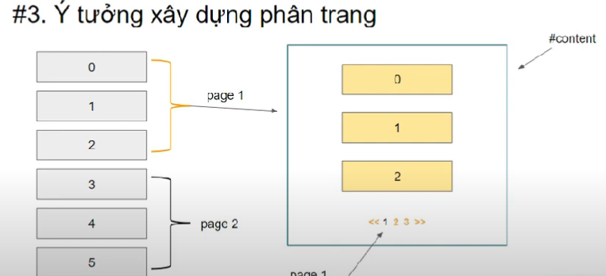
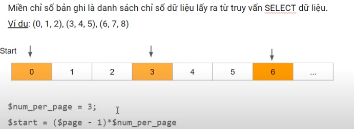

## CHECKLIST XÂY DỰNG PHÂN TRANG

1. Xây dựng dữ liệu
2. Xây dựng giao diện
3. Ý tưởng xây dựng phân trang



| STT | Tham số       | Ý nghĩa                          |
| --- | ------------- | -------------------------------- |
| 1   | rium_per_page | Số lượng bản ghi/ trang          |
| 2   | total_row     | Tổng số bản ghi                  |
| 3   | num_page      | Tổng số trang                    |
| 4   | start         | Chỉ số bản ghi bắt đầu mỗi trang |
| 5   | page          | Chỉ số trang hiện tại            |

4. Tính số lượng trang
   `$num_page=ceil($total_row,$num_per_page);`

-   $total_row: Tổng số bảng ghi
-   $num_per_page: Số bảng ghi mỗi trang

| $total_row | $num_per_page | $num_page |
| ---------- | ------------- | --------- |
| 10         | 4             | 3         |
| 25         | 3             | 7         |
| 16         | 6             | 3         |

5. Xác định miền bản ghi trên mỗi trang



-   `$page = $_GET['page'];`
-   `$start là số bắt đầu trong bảng ở mỗi trang khác nhau (STT)`

6. Hiển thị danh sách theo trang
   `$sql = "SELECT * FROM `users`LIMIT {$start}, {$num_per_page}`

Xây dựng hàm

```php
function get_users($start, $num_per_page){
// Code xử lí
}
```

7. Hiển thị thanh phân trang
8. Nổi bật chỉ số trang hiện hành
