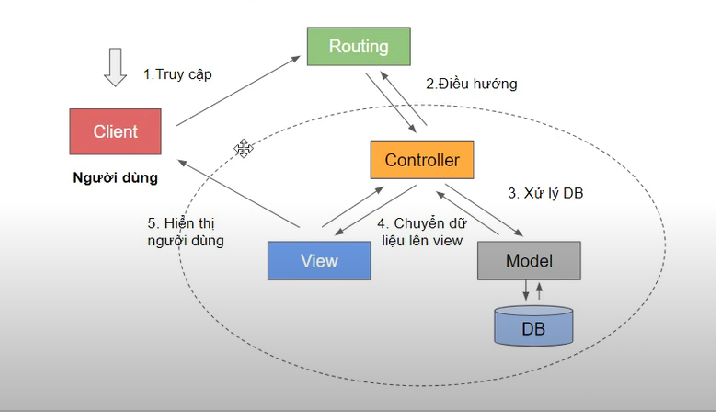

## Cấu trúc thư mục của MVC demo

• modules: Chưa các module hệ thống

-   controller
-   model
-   view

• lib: Thư viện các chức năng như database...
• heplper: Những hàm hệ thống như string, uri...
• public: Chứa file giao diện như css, js...
• config: Cấu hình hệ thống
• layout: giao diện dùng chung
• index.php: File nhận yêu cầu của người dùng

---

Giải thích:

## Index

-   `dirname()` : Hàm giúp lấy được đường dẫn của parent folder, cụ thể là folder mvc [dirname](https://www.w3schools.com/php/func_filesystem_dirname.asp)

    -   $app_path : Đường dẫn hệ thống

### Core

`DIRECTORY_SEPARATOR` : Định nghĩa cho dấu `/`

Lõi hệ thống

-   appload.php: Phần ứng dụng
-   base.php: Phần nền tảng nhất
-   router.php: Dùng để điều hướng người dùng
